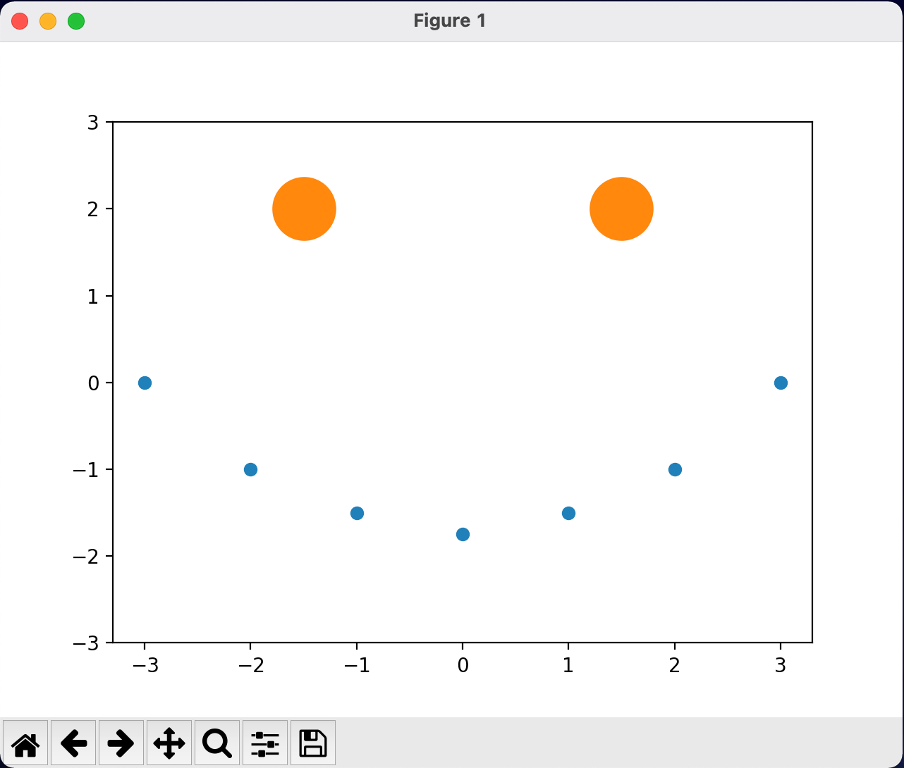

# SciPy 2022 Tutorial: Introduction to Numerical Computing With NumPy

#### Presented by: Logan Thomas, [Enthought, Inc.](https://www.enthought.com)

This repository contains all the material needed by students registered for the Numpy tutorial of [SciPy 2022](https://www.scipy2022.scipy.org/) on Monday, July 11th 2022.

For a smooth experience, you will need to make sure that you install or update your Python distribution and download the tutorial material _before_ the day of the tutorial.

## Running the Exercises the (recommended) Easy Way

Run with Binder by clicking this icon: [](https://mybinder.org/v2/gh/enthought/Numpy-Tutorial-SciPyConf-2022/main)


## Running the Exercise Locally

### Install Python

If you don't already have a working python distribution, you may download Anaconda Python ([https://www.anaconda.com/products/individual](https://www.anaconda.com/products/individual)).


### Install Packages

To be able to run the examples, demos and exercises, you must have the following packages installed:

- `ipython` (for running, experimenting, and doing exercises)
- `jupyter` (for access to the Jupyter Notebook web-based interactive computing platform)
- `matplotlib`
- `numpy`
- `pillow`
- `pyqt`

If you are using Anaconda, you can use the Anaconda Prompt (Windows) or Terminal.app (macOS) to create an environment with the necessary packages:

1. Open the Anaconda Prompt or Terminal.app using the below instructions:
    - **Windows**: Click Start and search for "Anaconda Prompt". Click on the application to launch a new Anaconda Prompt window.
    - **macOS**: Open Spotlight Search (using Cmd+Space) and type "Terminal.app". Click on the application to launch a new Terminal.app window.   

1. Create a new Anaconda virtual environment by executing the below command in the application window you opened in step 1 above. You may be prompted to `Proceed([y]/n)?`. If so, type `y` and press `Enter`.

    ```
    $ conda create -n numpy-tutorial ipython jupyter matplotlib numpy pillow pyqt 
    ```

1. Navigate to the directory where you'd like to store materials for this tutoiral and download the materials from this GitHub repository by executing the below command. It will create a new folder named `Numpy-Tutorial-SciPyConf-2022/` with all the content you will need.

    ```
    $ git clone git@github.com:enthought/Numpy-Tutorial-SciPyConf-2022.git
    ```
    **NOTE**: If you are not familiar with Git, you can download a zipped archive of the material by clicking on this link: https://github.com/enthought/Numpy-Tutorial-SciPyConf-2022/archive/main.zip. Then, unpack the zipped archive into a directoy named `Numpy-Tutorial-SciPyConf-2022`. You may have to rename the unpacked directory to explicitly be `Numpy-Tutorial-SciPyConf-2022`.


1. To test your installation, please execute the `check_env.py` script in the python virtual environment where you have installed the requirements (from step 2 above).
 
    If you created an Anaconda environment using the instructions above, you can use the same application window that you opened in step 1, or launch the platform specific application again -- Anaconda Prompt for Windows or Terminal.app for macOS.
    Be sure to navigate to where you downloaded this GitHub repository and activate your conda environment *before* executing `python check_env.py`:

    ```
    # Example path to course materials (yours may differ)
    $ cd ~/Desktop/Numpy-Tutorial-SciPyConf-2022/
    
    $ conda activate numpy-tutorial
    
    $ python check_env.py
    ```

    You should see a window pop up with a plot that looks vaguely like a smiley face (as shown below).

    

## Tutorial Materials

This GitHub repository is all that is needed in terms of tutorial content. If you downloaded these materials in step 3 above, there is no need to do so again. If not, the simplest solution is to download the material using this link:

https://github.com/enthought/Numpy-Tutorial-SciPyConf-2022/archive/main.zip

If you are familiar with Git, you can also clone this repository with:

```
$ git clone https://github.com/enthought/Numpy-Tutorial-SciPyConf-2022.git
```

The above command will create a new folder named `Numpy-Tutorial-SciPyConf-2022/` with all the content you will need: the slides I will go through (`introduction_to_numerical_computing_with_numpy_manual.pdf`), and a folder of exercises.


## Questions? Problems?

You may post messages to the `#tutorial-intro-to-numerical-computing-with-numpy` Slack channel for this tutorial at in the official Slack team: [https://scipy2022.slack.com](https://scipy2022.slack.com) .


## Additional Anaconda Resources
- [Managing environments](https://docs.conda.io/projects/conda/en/latest/user-guide/tasks/manage-environments.html)

  - To create an Anaconda environment from an existing `environment.yml` file:

    ```
    $ conda env create -f environment.yml -n numpy-tutorial
    ```

  - To remove an existing Anaconda environment:

    ```
    $ conda remove --name numpy-tutorial --all
    ```

- To completely uninstall Anaconda, see the "Uninstalling Anaconda" documentation [here](https://docs.anaconda.com/anaconda/install/uninstall/). 


© 2001-2022, Enthought, Inc.
All Rights Reserved. Use only permitted under license. Copying, sharing, redistributing or other unauthorized use strictly prohibited.
All trademarks and registered trademarks are the property of their respective owners.
Enthought, Inc.
200 W Cesar Chavez Suite 202
Austin, TX 78701
www.enthought.com
